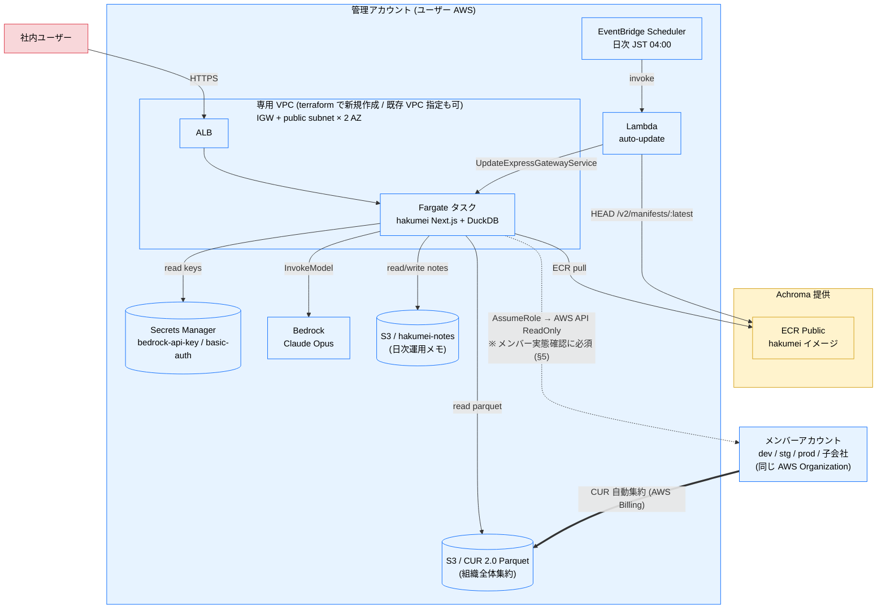

# hakumei 導入手順

このディレクトリは **hakumei (AWS コスト可視化・分析ツール)** を自社 AWS アカウントにデプロイするための Terraform 一式です。

hakumei は Cost and Usage Report (CUR) と AWS API をソースに、詳細なコストレポートとコスト削減推奨を提示します。`terraform.tfvars` に必要な情報を埋めて `terraform apply` するだけで、アプリケーションと Web UI が立ち上がります。

**配布モデル**: セルフデプロイ方式。Achroma が提供するのは ECR Public 上のコンテナイメージのみで、ホスティング・Bedrock・S3・Secrets Manager 等の AWS コストは**ユーザー負担**となります。AI 推論に使う Bedrock も**ユーザー自身の AWS アカウント**で発行した API キーで呼び出すため、推論データもユーザー AWS 内で完結し Achroma を経由しません。

---

## 1. hakumei とは

CUR と AI を組み合わせて、AWS のコスト変動・推奨節約・実態の可視化を行う Web アプリケーションです。

主な機能:

- 月次・期間別コストレポート (AI による要約 / 異変検知 / Top5 ハイライト)
- 推奨節約 (Cost Optimization Hub + Savings Plans / Reserved Instances)
- リソースドリルダウン (どのアカウント・どのサービスが使っているか)
- AI チャット (自然言語 QA + AWS API による実態確認。「先月の RDS が高い理由は?」「この EBS は本当に未使用?」に実データで答える)
- 日次ノート (運用メモを残してチャットの背景情報として渡せる)

技術スタック: Next.js 15 / TypeScript / DuckDB / Bedrock Claude Opus / ECS Express Mode (Fargate)。

### AWS 標準コストツールとの違い

AWS 標準のコストツール (Cost Explorer / Cost Optimization Hub / Trusted Advisor / Compute Optimizer) は、hakumei にとって置き換え対象ではなく**参照する一次情報**です。hakumei はこれらを CUR (請求実績の生データ) と AWS API (実リソース) の裏取りでラップし、人がコンソールを巡回して読み解く運用コストなしで、より高い解像度の情報を提供します。

#### hakumei を使うべき理由

- **標準の最適化推奨に現れない浪費を検出する**: Cost Optimization Hub / Compute Optimizer の推奨は EC2・EBS・Lambda・RDS・NAT 等のリソース単位が中心。hakumei はその枠外にある浪費 — ネットワーク利用量の中身 (NAT Gateway 高転送に対する S3 Gateway Endpoint 未設定の検出・リージョン間 / AZ 間転送・CloudFront アウトバウンド)、ライフサイクル未設定の S3 バケット、無期限保持の CloudWatch Logs、古い EBS / RDS スナップショット — を CUR の実利用データから直接検出します。EBS は「アタッチ済みだが IOPS ゼロ」の実質未使用まで踏み込みます
- **推奨を概算のまま出さない**: 標準ツールの削減推奨 (メトリクスベースの概算) を CUR 実コスト・実リソースと突合し、妥当性 (妥当 / 条件付き / 疑わしい) を AI が判定してから提示します。例えば Cost Optimization Hub が「EC2 の rightsize で月 $120 削減」と推奨しても、CUR 上のそのインスタンスの直近 30 日実コストが $40 なら、削減見込みが実際の支出を上回っており概算の前提が実態と乖離しています。hakumei はこれを「疑わしい」と根拠付きで併記するため、効果の薄い推奨に作業時間を使わずに済みます
- **運用コストを下げる**: 各コンソールを人が巡回・照合する代わりに、コストレポート・削減推奨・AI サマリが 1 ページに自動で揃います。裏取りも AI チャットが AWS API を直接叩いて完結します

| AWS 標準ツール | 標準のままだと | hakumei では |
| --- | --- | --- |
| Cost Explorer | コンソールでフィルタ・グループ化を操作しながら人が分析。集計値ベース | CUR 生データを直接集計し、月次レポート + AI 要約・異変検知・Top5 ハイライトを自動生成。「先月の RDS が高い理由は?」と自然言語で聞ける |
| Cost Optimization Hub | 推奨一覧を人が開いて確認。削減額はメトリクスベースの概算で、実際に効くかは個別に検証が必要 | 推奨を自動取得し、CUR の実コストと突合して妥当性を AI が判定した上で推奨節約ページに統合 |
| Trusted Advisor | チェック項目を人が定期巡回 | コスト系チェックを自動取得し、推奨節約ページに統合 |
| Compute Optimizer | rightsize 推奨をサービスごとの画面で確認 | Cost Optimization Hub 経由で集約される rightsize 推奨に加え、CUR ネイティブ検出 (未使用 EBS / S3 ライフサイクル / NAT 転送 / CloudWatch Logs 等) を同一ページに統合 |
| AWS FinOps Agent (2026-06 発表、preview) | コスト QA・異常調査・定期レポートを行うマネージドエージェント。ただしデータソースは Cost Explorer 集計値 + 課金系 API + CloudTrail のみで、実リソースの現在の状態には触れない。動作は us-east-1 のみ (コスト対象は全リージョン)、GA 後の料金未発表 | 自然言語 QA を CUR 生データ粒度で行い、AI チャットは AWS API で実リソースの実態確認まで裏取り。データは顧客 AWS アカウント内で完結し、東京リージョンで動作 |
| 各サービスコンソール (EC2 / RDS 等) | 推奨の裏取り (本当に未使用か等) は各コンソール・各アカウントを人が見て回る | AI チャットが AWS API を直接叩き、組織横断で実リソースを確認 (§5) |

> AWS FinOps Agent の記載は 2026-07 時点 (public preview)。機能・料金は GA までに変わる可能性があります。

### 検出できるコスト削減推奨

推奨節約ページでは、CUR と AWS API (Cost Optimization Hub / 実リソース API) を突合し、以下の項目を検出します。

**EC2 / EBS**

- 未使用 EBS ボリューム (未アタッチ / アタッチ済でも IOPS ゼロ)
- 古い EBS スナップショット
- EC2 rightsize 候補 (オーバースペックのインスタンス)

**S3**

- ライフサイクル未設定の S3 バケット (Standard ストレージの放置)

**RDS**

- RDS スナップショットの長期保管
- RDS / Aurora インスタンス・ストレージの rightsize 候補

**Network**

- NAT Gateway の高転送 (S3 Gateway Endpoint 未設定の検出を含む)
- リージョン間 / AZ 間のデータ転送
- CloudFront アウトバウンド転送
- アイドル Elastic IP / 追加 Public IPv4
- 遊休 NAT Gateway

**その他**

- CloudWatch Logs の保持期間 (無期限ロググループの蓄積)
- Lambda 関数の rightsize 候補
- ECS (Fargate) タスクの rightsize 候補

**SP / RI (コミットメント)**

- Savings Plans / Reserved Instances の未活用 commitment
- Savings Plans の購入推奨 (1 年 / 3 年 × 前払いなし / 全額前払いの 4 パターン試算)
- Reserved Instances / 予約キャパシティの購入推奨 (EC2 / RDS / OpenSearch / Redshift / ElastiCache / MemoryDB / DynamoDB)

Cost Optimization Hub 由来の推奨は、AI が CUR の実コストと突合して妥当性 (妥当 / 条件付き / 疑わしい) を併記します。

### アーキテクチャ全体像




凡例:

- **黄系**: Achroma 提供 (ECR Public のコンテナイメージのみ)
- **青系**: ユーザー AWS アカウント内のリソース (terraform で作るもの + ユーザーが用意する Bedrock)
- **実線**: 本配布版が構築する経路 (デプロイ後すぐ動く)
- **太線 (==>)**: AWS Billing による CUR 自動集約 (terraform 管轄外、AWS Organization で設定済み前提)
- **破線**: メンバーアカウント側で別途 apply が必要 (本体の apply では作られない。AI チャットの実態確認に必須、§5 の手順で構築)

メンバーアカウントから管理アカウントへの CUR 集約は AWS Billing が自動で行うため、hakumei は管理アカウントの CUR S3 を読むだけで組織全体のコストが見えます。一方、AI チャットの実態確認 (EC2 describe 等の実リソース参照) は CUR 集約とは別経路のため、メンバーアカウントに対しては AssumeRole の経路構築が必須です (§5)。

---

## 2. 前提条件 (デプロイ前に必ず確認)

### AWS 環境

- **AWS アカウント** 1 つ (CUR 集約先のアカウント。組織管理アカウント or 専用アカウント)
- **AWS Cost and Usage Report 2.0 (CUR 2.0)** が S3 に配信されている
  - 設定: AWS Billing Console → Data Exports → Standard data export → CUR 2.0
  - **Parquet 形式 / 時間粒度 (Hourly)** が必須
  - 組織全体のコストを集約する場合は管理アカウントで設定
- **ap-northeast-1 (東京リージョン)** を利用可能 (本配布バージョンは ap-northeast-1 のみ動作保証)
  - ECS Express Mode の対応リージョン: [AWS 公式ドキュメント](https://docs.aws.amazon.com/AmazonECS/latest/developerguide/express-mode-regions.html)
- メンバーアカウントを持つ組織では、**各メンバーアカウントに terraform apply できる credential** (AI チャットの実態確認に必須の read-only ロールをメンバーアカウント側に作成するため。§5)

### ローカル環境

- **Terraform 1.11 以上** ([インストール](https://developer.hashicorp.com/terraform/install)) — tfstate に値を保存しない write-only attribute (ephemeral 変数 + `secret_string_wo`) を使うため
- **AWS CLI v2** ([インストール](https://docs.aws.amazon.com/cli/latest/userguide/getting-started-install.html))
- 対象アカウントに対して `terraform apply` できる権限の AWS CLI プロファイル (詳細は §3)

### Bedrock

ユーザー自身の AWS アカウントで以下を準備します。

- **モデルアクセスの有効化**: 利用リージョンで **Claude Opus 4.8** (`jp.anthropic.claude-opus-4-8`) のモデルアクセスを有効化 (AWS Console → Amazon Bedrock → Model access)
- **Bedrock 長期 API キーの発行** ([発行手順](https://docs.aws.amazon.com/bedrock/latest/userguide/api-keys.html))
  - 自社アカウントの Bedrock を呼ぶため、Bedrock 利用料は自社の AWS 請求に計上されます
  - キー文字列は `terraform.tfvars` の `bedrock_api_key` に渡し、apply 時に Secrets Manager へ投入されます (tfvars は git commit しない)

### ネットワーク

デフォルトでは hakumei 専用の VPC + Internet Gateway + public subnet (2 AZ) + route table を**新規作成**します。既存の VPC / subnet には一切影響せず、追加準備は不要です。

カスタマイズしたい場合のオプション:

- `vpc_cidr` (デフォルト `10.0.0.0/16`): 既存 VPC との CIDR 衝突を避けたいとき
- `subnet_ids`: 既存の public subnet ID を 2 つ以上 (異なる AZ・同一 VPC) 指定すると、専用 VPC を作らずそれを流用します
  ```hcl
  subnet_ids = ["subnet-aaaa", "subnet-bbbb"]
  ```
  指定する subnet は public (IGW へのルートを持ち、public IP 自動割当が有効) である必要があります。NAT 経由のプライベート subnet を使う場合は `public.ecr.aws` / Bedrock / S3 への到達経路を別途確保してください。

---

## 3. terraform apply に必要な IAM 権限

terraform apply を実行する IAM ユーザー / ロールに必要な権限 (最小)。社内の admin 相当があれば不要ですが、最小権限で運用したい場合の参考:

- `ecs:*` (Express Service / Cluster の作成)
- `iam:CreateRole` / `AttachRolePolicy` / `PutRolePolicy` / `GetRole` / `PassRole` / `DeleteRole`
- `s3:*` (tfstate を S3 backend で運用する場合、およびノート永続化バケットの作成・削除)
- `ec2:Describe*` / `CreateSecurityGroup` / `AuthorizeSecurityGroup*` / `RevokeSecurityGroup*` / `DeleteSecurityGroup`
- `ec2:CreateVpc` / `CreateSubnet` / `CreateInternetGateway` / `AttachInternetGateway` / `CreateRouteTable` / `CreateRoute` / `AssociateRouteTable` / `ModifyVpcAttribute` / `CreateTags` および対応する `Delete*` (デフォルトの専用 VPC 新規作成時。`subnet_ids` 指定で既存 VPC を流用する場合は不要)
- `elasticloadbalancing:*` (ALB は ECS Express が自動作成するが describe 権限が要る)
- `secretsmanager:CreateSecret` / `PutSecretValue` / `DescribeSecret` / `DeleteSecret`
- `logs:CreateLogGroup` / `PutRetentionPolicy` / `DescribeLogGroups`
- `lambda:*` / `scheduler:CreateSchedule` / `DeleteSchedule` / `GetSchedule` / `UpdateSchedule` (自動更新を有効化する場合 = `auto_update_enabled = true` デフォルト)

---

## 4. セットアップ手順

### Step 1. ファイルをクローン

```bash
cp -r terraform/customer ~/hakumei-deploy
cd ~/hakumei-deploy
```

### Step 2. tfvars を埋める

```bash
cp terraform.tfvars.example terraform.tfvars
$EDITOR terraform.tfvars
```

最低限埋める項目:

- `aws_account_id` (12 桁)
- `customer_name` (英小文字・数字・ハイフン)
- `cur_s3_bucket` / `cur_s3_prefix`
- `bedrock_api_key` (§2 で発行したキー)
- `basic_auth_user` / `basic_auth_password` (Basic 認証、デフォルト ON)
- `member_account_ids` (メンバーアカウントを持つ組織では必須。§5 の実態確認セットアップで使用)

`terraform.tfvars` は **絶対に git commit しない**でください (`.gitignore` で除外済み)。

#### HTTPS について

ECS Express Mode が払い出す `*.ecs.<region>.on.aws` エンドポイントは **HTTPS のみで公開**されます (AWS Managed 証明書付き、HTTP/2、HTTP(80) は受け付けない)。デフォルト URL で十分なら追加設定不要です。`service_url` output に HTTPS URL が出力されます。

#### 自社ドメインで HTTPS 公開 (任意)

`domain_name` + `route53_hosted_zone_id` をペアで指定すると、ACM 証明書発行 → ECS Express HTTPS listener に SNI 追加 → Route 53 Alias レコード作成までを自動で行います:

```hcl
domain_name            = "hakumei.example.com"
route53_hosted_zone_id = "Z0123456789ABCDEFGHIJ"
```

apply で自動構築されるもの:

- `aws_acm_certificate` (ap-northeast-1、DNS validation)
- DNS validation 用 CNAME (指定 Hosted Zone)
- `aws_lb_listener_certificate` (HTTPS listener に SNI 追加)
- `aws_route53_record` (Alias A レコード)
- listener rule の host-header に `domain_name` を idempotent に追記

未指定 (`domain_name = null`) なら ECS Express デフォルト URL が `service_url` に出ます。

#### Basic 認証を無効化する場合

WAF / Cognito / 閉域 NW で独自にアクセス制御するなど Basic 認証が不要な構成では `basic_auth_enabled = false` を指定できます。**HTTPS は盗聴対策であって無認証公開対策ではない**ため、外部アクセス制御方式を `external_access_control_mitigation` で明示しないと apply はブロックされます:

```hcl
basic_auth_enabled                 = false
external_access_control_mitigation = "waf-cognito"   # または "private-network-only" / "reverse-proxy-auth"
```

許容される mitigation 方式:

- `"waf-cognito"` — ALB の前段に WAF + Cognito などのアプリ層認証を別途構築済み
- `"private-network-only"` — VPN / Tailscale / Direct Connect / 社内専用線 等の閉域 NW からのみアクセス
- `"reverse-proxy-auth"` — 認証機能付きリバプロ (Cloudflare Access / IAP / 自社 SSO 等) を別途構築済みで、本 ALB は直接公開しない

このとき:

- Secrets Manager (`<customer_name>/basic-auth`) は作成されません
- コンテナに `BASIC_AUTH_DISABLED=1` が注入され、アプリ層でも認証チェックがスキップされます
- **アクセス制御の責任はユーザー側**で確実に行ってください。Terraform は mitigation 構成の実在を検証しません
- CSRF 対策 (状態変更系メソッドの Origin / Content-Type 検証) は維持されます

### Step 3. terraform apply

```bash
export AWS_PROFILE=<your-profile>
terraform init
terraform plan
terraform apply
```

リソース作成は 1〜3 分で終わりますが、ALB ヘルスチェックが緑になりブラウザでアクセスできるまでさらに **3〜10 分**かかります (タスク起動 → ECR Public から image pull → アプリ起動 → target group healthy 判定)。

完了すると次の output が表示されます:

```
Outputs:

bedrock_secret_id = "hakumei/bedrock-api-key"
cluster_name      = "hakumei"
log_group         = "/aws/ecs/hakumei"
service_arn       = "arn:aws:ecs:ap-northeast-1:...:service/hakumei/hakumei-xxxx"
service_url       = "https://ha-xxxx.ecs.ap-northeast-1.on.aws"
```

#### 作成されるリソース

apply は以下を**すべて新規作成**します (既存リソースの変更・削除は行いません)。`destroy` で全て削除されます。


| 種別     | リソース                                                        | 備考                                                                    |
| ------ | ----------------------------------------------------------- | --------------------------------------------------------------------- |
| ネットワーク | VPC (`10.0.0.0/16`) + IGW + public subnet × 2 + route table | **デフォルト時のみ** (`subnet_ids` 未指定)。`subnet_ids` 指定時はこれらを作らず既存 subnet を流用 |
| ネットワーク | Security Group (ECS タスク用、outbound HTTPS)                    | 常時。新規 VPC or 指定 subnet の VPC に作成                                      |
| コンピュート | ECS クラスタ + ECS Express サービス (Fargate + ALB + オートスケール)       | 常時。ALB・ターゲットグループ・ALB 用 SG は ECS Express が自動構成                         |
| IAM    | ロール 3 種 (infrastructure / execution / task) + 付随ポリシー        | 常時。task ロールに CUR S3 read + COH/CE read + Bedrock InvokeModel 等        |
| シークレット | Secrets Manager: `<service_name>/bedrock-api-key`           | 常時                                                                    |
| シークレット | Secrets Manager: `<service_name>/basic-auth`                | `basic_auth_enabled = true` (デフォルト) のときのみ                             |
| ストレージ  | S3 バケット `<service_name>-notes-<aws_account_id>` (SSE-S3 / versioning / public block ALL / 旧バージョン 30 日 expire / force_destroy) | 常時。ノート (日次運用メモ) の永続化。アプリ env `NOTES_S3_BUCKET` 経由で参照                  |
| ログ     | CloudWatch Logs `/aws/ecs/<service_name>` (30 日保持)          | 常時                                                                    |
| 自動更新   | Lambda + EventBridge Scheduler + 専用 IAM ロール 2 種 + Lambda Logs | `auto_update_enabled = true` (デフォルト) のときのみ。§7 参照                       |
| ドメイン   | ACM 証明書 + Route 53 レコード + ALB listener 証明書                  | カスタムドメイン指定時 (`domain_name` + `route53_hosted_zone_id`) のみ             |


> 既存の S3 (CUR バケット) と Route 53 Hosted Zone (カスタムドメイン時) は**参照のみ**で、作成・変更しません。

### Step 4. アクセス確認

```bash
open "$(terraform output -raw service_url)"
```

Basic 認証で `basic_auth_user` / `basic_auth_password` を入力するとレポート画面が表示されます。初回は CUR の集計に数秒〜数十秒かかります。AI チャット (右上アイコン) で「先月のコスト要因を分析して」と聞けば、自社アカウントの Bedrock 経由で AI が回答します。

---

## 5. メンバーアカウントの実態確認セットアップ (必須)

hakumei の AI チャットは、CUR のコスト分析に加えて **AWS API で実リソースを直接確認する「実態確認」** (EC2 describe 等) を行います。推奨や異変の裏取り (本当に未使用か・今も存在するか) をコンソールを開かずに完結させるための、hakumei のコア機能です。

- **管理アカウント自身**の実態確認は追加設定なしで動きます (§4 の apply でタスクロールに read-only 権限を付与済み)
- **メンバーアカウント (dev / stg / prod / 子会社等) の実態確認には、本節の AssumeRole 経路構築が必須**です。未構築の場合、AI チャットはメンバーアカウントのコスト分析 (CUR) はできますが、実リソースの確認ができません
- メンバーアカウントを持たない単一アカウント構成のみ、本節をスキップできます

仕組み: 本体スタックのタスクロールに `sts:AssumeRole` を許可し、各メンバーアカウントに read-only ロール (`hakumei-readonly-role`、AWS 管理 ReadOnlyAccess) を作ります。双方が相手を名指しで限定するため、指定したアカウント以外へは届きません。

手順:

1. 本体スタックの `terraform.tfvars` に対象メンバーアカウント ID を追加して再 apply

   ```hcl
   member_account_ids = ["234567890123", "345678901234"]
   ```

2. タスクロール ARN を控える

   ```bash
   terraform output task_role_arn
   ```

3. **各メンバーアカウントの credential に切り替えて** `member-readonly-role/` を apply (メンバーごとに繰り返し)

   ```bash
   cd member-readonly-role
   cp terraform.tfvars.example terraform.tfvars
   # member_account_id と trusted_principal_arn (手順 2 の値) を記入
   export AWS_PROFILE=<メンバーアカウントのプロファイル>
   terraform init && terraform apply
   ```

   メンバーアカウントごとに tfstate を分けてください (backend の key を変える / ディレクトリを複製する等。`member-readonly-role/main.tf` のコメント参照)。

4. 動作確認: hakumei の AI チャットで対象アカウントのリソースを質問する (例: 「アカウント 234567890123 の EC2 インスタンス一覧を見せて」)。`AccessDenied` になる場合は、手順 1 の再 apply 漏れ・手順 3 の apply 先アカウント違いを確認してください。

対象を外す場合は逆順で、`member_account_ids` から削除して本体を再 apply し、メンバー側は `terraform destroy` します。

---

## 6. トラブルシュート

### 「This site can't be reached」/ タイムアウト

- ALB のヘルスチェックが緑になるまで 2〜5 分。`terraform apply` 完了直後はまだ起動中の可能性
- CloudWatch Logs でタスクのログを確認
  ```bash
  aws logs tail "$(terraform output -raw log_group)" --since 10m --region ap-northeast-1
  ```

### Basic 認証は通るが画面が真っ白 / レポートにデータが出ない

- CUR バケットのアクセス権限を確認:
  ```bash
  aws s3 ls "s3://<cur_s3_bucket>/<cur_s3_prefix>/" --region ap-northeast-1
  ```
  0 件なら CUR がまだ配信されていません (新規 export は最初の配信まで 24 時間程度)
- タスクログに `AccessDenied` がないか確認 (タスクロール → CUR バケット間の権限不足)

### AI チャット / AI サマリが `AccessDenied` / 401

- Bedrock API キーが未投入 or 無効 (Step 2 で `bedrock_api_key` を埋めて再 apply)
- 自社の Bedrock でモデルアクセス (Claude Opus 4.8) が有効か、API キー自体が有効かを AWS Console で確認
- リージョンに Claude Opus 4.8 が提供されているか確認 (未提供なら `BEDROCK_REGION` env で提供リージョンを指定)

### `terraform apply` が `RoleNotFoundException` で失敗する

- 同じ `customer_name` で前回 destroy せずに作り直そうとしている可能性
- `terraform destroy` で削除してから再 apply、または `customer_name` を別の値に変更

### コンテナの image pull が失敗する (`CannotPullContainerError`)

- ECR Public (`public.ecr.aws`) への到達経路を確認
- VPC エンドポイントを使う構成では `com.amazonaws.<region>.ecr.dkr` + `com.amazonaws.<region>.ecr.api` + `com.amazonaws.<region>.s3` の 3 つが必要
- デフォルト VPC + public subnet なら通常問題なし

### 自動更新が動いていない / 新バージョンが反映されない

- Lambda 実行ログを確認 (CloudWatch Logs `/aws/lambda/<service_name>-auto-update`)
  ```bash
  aws logs tail "/aws/lambda/$(terraform output -raw service_name)-auto-update" --since 24h --region ap-northeast-1
  ```
- EventBridge Scheduler が有効か確認 (`aws scheduler get-schedule --name $(terraform output -raw service_name)-auto-update --region ap-northeast-1`)
- Lambda を手動 invoke して挙動を確認 (§7「手動で即時更新する」参照)
- `auto_update_enabled = false` にしていないか tfvars を再確認

---

## 7. バージョン更新

### 自動更新 (デフォルト ON)

`terraform apply` 後、毎日 **JST 04:00** に Lambda が ECR Public 上の `hakumei:latest` の最新 digest を取得して ECS Express を再デプロイします。ユーザー側の手動運用は不要です。すでに同じ digest が走っていれば no-op で終了するため再 invoke しても害はありません。

仕組み: EventBridge Scheduler → Lambda (Python 3.12) → ECR Public へ Docker Registry V2 protocol で manifest を HEAD し `Docker-Content-Digest` を取得 → `ecs update-express-gateway-service` で `image = ...@sha256:<digest>` に差し替え (ECS Express は image 文字列が同一だと再 pull しないため digest 固定が必須)。Lambda 実行ログは CloudWatch `/aws/lambda/<service_name>-auto-update` に出力されます。

スケジュールを変えたい場合:

```hcl
update_schedule_cron     = "cron(0 3 * * ? *)"   # 例: 03:00
update_schedule_timezone = "Asia/Tokyo"
```

自動更新を止めたい場合 (バージョンを自分で固定したいケース):

```hcl
auto_update_enabled = false
app_image           = "public.ecr.aws/y2a9a6u8/hakumei:sha-xxxxxxx"  # 固定したい version
```

### 手動で即時更新する

新バージョンを 04:00 を待たずに反映したいときは、Lambda を 1 回手動 invoke するのが最速です:

```bash
aws lambda invoke \
  --function-name "$(terraform output -raw auto_update_lambda_function_name)" \
  --region ap-northeast-1 \
  /tmp/auto-update.out && cat /tmp/auto-update.out
```

`auto_update_enabled = false` で運用している場合、または特定 digest にロールバックしたい場合は ECS API を直接叩きます:

```bash
aws ecs describe-express-gateway-service \
  --service-arn "$(terraform output -raw service_arn)" \
  --region ap-northeast-1 \
  --query 'service.activeConfigurations[0].primaryContainer' \
  --output json > /tmp/primary.json

jq '.image = "public.ecr.aws/y2a9a6u8/hakumei:sha-<new-sha>"' /tmp/primary.json > /tmp/primary.updated.json

aws ecs update-express-gateway-service \
  --service-arn "$(terraform output -raw service_arn)" \
  --primary-container file:///tmp/primary.updated.json \
  --region ap-northeast-1
```

`describe-service-deployments` で SUCCESSFUL になれば完了です。

---

## 8. アンインストール

```bash
terraform destroy
```

本配布版が作成したすべての AWS リソース (専用 VPC / IGW / subnet / route table / ECS / ALB / SG / IAM ロール / Secrets / Log group / Lambda / EventBridge Scheduler / ノート S3 バケット) が削除されます。ノートバケットは `force_destroy = true` を付与しているため中身ごと削除されます。`subnet_ids` で既存 VPC を流用した場合、その VPC / subnet は既存リソースのため削除されません。

注意点:

- **所要時間 20〜40 分** (`aws_ecs_express_gateway_service` の draining が長い)。タイムアウトで一旦失敗しても、再度 `terraform destroy` で続行できます
- CUR S3 バケットは削除されません
- Bedrock API キーの Secret は terraform 管理下のため削除されます。destroy 後に API キー自体が不要なら AWS Console で無効化 / 削除してください

### destroy が `DependencyViolation` で失敗し続ける場合

ECS Express service が `DRAINING` のまま長時間 (1〜2 時間) 解放されないと、Security Group / ALB / ENI が一緒に残り `terraform destroy` がリトライしても以下で失敗します:

```
Error: deleting Security Group (sg-xxxxx): DependencyViolation: resource has a dependent object
```

対処:

```bash
# 1. ECS タスクを強制停止
aws ecs list-tasks --cluster hakumei --region ap-northeast-1 --query 'taskArns' --output text \
  | xargs -n1 -I{} aws ecs stop-task --cluster hakumei --task {} --region ap-northeast-1

# 2. service が INACTIVE になるまで数十分〜数時間待つ
aws ecs describe-express-gateway-service \
  --service-arn "$(terraform output -raw service_arn)" \
  --region ap-northeast-1 \
  --query 'service.status.statusCode' --output text

# 3. INACTIVE になったら terraform destroy をリトライ
terraform destroy

# 4. それでも SG が残る場合は terraform 管理から外し、AWS 側の自然解放に任せる
#    (ECS service 完全解放時に SG も一緒に消える)
terraform state rm aws_security_group.ecs
```

AWS ECS Express Mode (2025-11 GA) の destroy 仕様の制約で、どの環境でも発生する可能性があります。

---

## 9. 相談ベースの拡張 (本配布バージョン非対応)

以下は本配布バージョンには含めていません。希望する場合は Achroma に相談してください。

| 機能           | 概要                                    |
| ------------ | ------------------------------------- |
| **他リージョン対応** | ap-northeast-1 以外 (us-east-1 等) でのデプロイ |


---

## 10. 配布バージョン情報

- **配布リポジトリ**: https://github.com/Achroma-inc/hakumei
- **app_image (default)**: `public.ecr.aws/y2a9a6u8/hakumei:latest` (`auto_update_enabled = true` で日次自動追従)
- **対応リージョン**: ap-northeast-1
- **動作確認済み Terraform**: 1.11+
- **動作確認済み AWS provider**: 6.x

新版は ECR Public の `:latest` に都度 push されるため、デフォルト設定 (`auto_update_enabled = true`) であれば毎日 JST 04:00 に自動反映されます (§7)。

---

## 11. サポート

- 不具合 / 質問: Achroma 担当者 (Slack DM)
- セキュリティ問題: Achroma セキュリティ窓口

